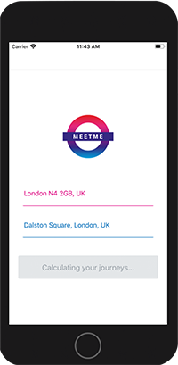

# MeetMe App

React Native app which picks and gives directions to a convenient location to travel to from two addresses in London, UK. Built with Expo.




## Data

The directions data is provided by the TFL API, so only works for the Greater London area.

## Development

Create the following `.env` file in the project root:

```
REACT_NATIVE_GOOGLE_MAPS_API_KEY=<GOOGLE_MAPS_KEY>
REACT_NATIVE_APP_JOURNEY_API_HOST=<API_HOST_URL
```

Instal dependencies:

```
npm i
```

And then run:

```
npm run start
```

To debug app using the React Native Debugger, run:

```
npm run debug
```

Before running `npm run start`.

## Deployment

```
expo build:ios
```
